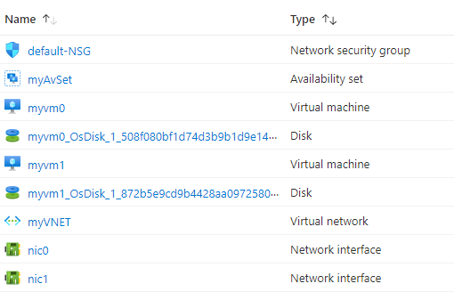

# Terraform: 201-vm-copy-index-loops
## Create Virtual Machines using Resource Loops
## Description 
This is an Azure quickstart sample terraform configuration based on ARM template *[201-vm-copy-index-loops](https://github.com/Azure/azure-quickstart-templates/tree/master/201-vm-copy-index-loops)* from the repository *[azure\azure-quickstart-templates](https://github.com/Azure/azure-quickstart-templates)*.

This template allows you to create 'N' number of Virtual Machines in an availability set based on the 'numberOfInstances' parameter specified during the template deployment. This template also deploys a Storage Account, Virtual Network, 'N' number of Public IP addresses/Network Inerfaces/Virtual Machines, and it will deploy the following resources...



> ### Note:
> If the specified resource group is already exist then the script will not continue with the deployment. If you want to deploy the resources to the existing resource group, then import the resource group to state before deployment.

### Syntax
```
# To initialize the configuration directory
PS C:\Terraform\201-vm-copy-index-loops> terraform init 

# To check the execution plan
PS C:\Terraform\201-vm-copy-index-loops> terraform plan

# To deploy the configuration
PS C:\Terraform\201-vm-copy-index-loops> terraform apply
```

### Example
```
# Initialize
PS C:\Terraform\201-vm-copy-index-loops> terraform init 

# Plan
PS C:\Terraform\201-vm-copy-index-loops> terraform plan -var="adminUsername=cloudguy" 

var.adminPassword
The admin password of the VM.
Enter a value: *********

<--- output truncated --->

# Apply
PS C:\Terraform\201-vm-copy-index-loops> terraform apply -var="adminUsername=cloudguy" 

var.adminPassword
The admin password of the VM.
Enter a value: *********
```
## Output
```
azurerm_resource_group.arg-01: Creating...
azurerm_resource_group.arg-01: Creation complete after 1s 
azurerm_availability_set.aas-01: Creating...
azurerm_network_security_group.ansg-01: Creating...

<--- output truncated --->

azurerm_linux_virtual_machine.al-01[1]: Still creating... [2m31s elapsed]
azurerm_linux_virtual_machine.al-01[1]: Creation complete after 2m40s 

Apply complete! Resources: 10 added, 0 changed, 0 destroyed.
```

> Azure Cloud Shell comes with Azure PowerShell pre-installed and you can deploy the above resources using Cloud Shell as well.
>
>[](https://shell.azure.com)
