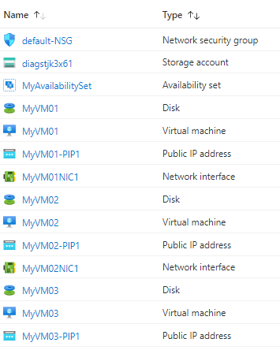

# Terraform: 201-vm-copy-managed-disks
## Multi VM Template with Managed Disk
## Description 
This is an Azure quickstart sample terraform configuration based on ARM template *[201-vm-copy-managed-disks](https://github.com/Azure/azure-quickstart-templates/tree/master/201-vm-copy-managed-disks)* from the repository *[azure\azure-quickstart-templates](https://github.com/Azure/azure-quickstart-templates)*.

This configuration will provision N number of virtual machines with your choice in a single VNET. Every VM will be provisioned with a Network Interface and a Public IP resource. All the VMs will be provisioned in a single Availability Set. A single storage account will be provisioned to store the diagnostic information. If you provision 3 VM’s with this template, your resources will look like below in the resource group, and it will deploy the following resources...



> ### Note:
> If the specified resource group is already exist then the script will not continue with the deployment. If you want to deploy the resources to the existing resource group, then import the resource group to state before deployment.

### Syntax
```
# To initialize the configuration directory
PS C:\Terraform\201-vm-copy-managed-disks> terraform init 

# To check the execution plan
PS C:\Terraform\201-vm-copy-managed-disks> terraform plan

# To deploy the configuration
PS C:\Terraform\201-vm-copy-managed-disks> terraform apply
```

### Example
```
# Initialize
PS C:\Terraform\201-vm-copy-managed-disks> terraform init 

# Plan
PS C:\Terraform\201-vm-copy-managed-disks> terraform plan -var="adminUsername=cloudguy" 

var.adminPassword
The admin password of the VM.
Enter a value: *********

<--- output truncated --->

# Apply
PS C:\Terraform\201-vm-copy-managed-disks> terraform apply -var="adminUsername=cloudguy" 

var.adminPassword
The admin password of the VM.
Enter a value: *********
```
## Output
```
random_string.rs: Creating...
random_string.rs: Creation complete after 0s [id=jk3x61]
azurerm_resource_group.arg-01: Creating...
azurerm_resource_group.arg-01: Creation complete after

<--- output truncated --->

azurerm_windows_virtual_machine.aw-01[0]: Still creating... [2m0s elapsed]
azurerm_windows_virtual_machine.aw-01[0]: Creation complete after 2m5s
azurerm_windows_virtual_machine.aw-01[1]: Creation complete after 2m6s 

Apply complete! Resources: 17 added, 0 changed, 0 destroyed.
```

> Azure Cloud Shell comes with Azure PowerShell pre-installed and you can deploy the above resources using Cloud Shell as well.
>
>[](https://shell.azure.com)
